# 📈 Real-Time Trend Detection System

An end-to-end Machine Learning pipeline that predicts short-term crypto market trends. Built to demonstrate **Production ML** principles: containerization, modular code, and API deployment.

## 🏗 Architecture

```mermaid
graph LR
    A["🌍 Real-Time Data<br>(yfinance)"] -->|Ingest| B("🐍 Data Pipeline")
    B -->|"Clean & Feature Eng"| C{"🤖 XGBoost Model"}
    C -->|"Train & Evaluate"| D["💾 Model Artifact"]
    D -->|Load| E["🐳 Docker Container"]
    E -->|Serve| F["🚀 FastAPI"]
    F -->|Visualize| G["📊 Streamlit Dashboard"]
```


## 🚀 How to Run (Docker)
You can run the inference API anywhere with Docker:

```bash
# 1. Build
docker build -t trend-api:v1 .

# 2. Run
docker run -p 8000:8000 trend-api:v1